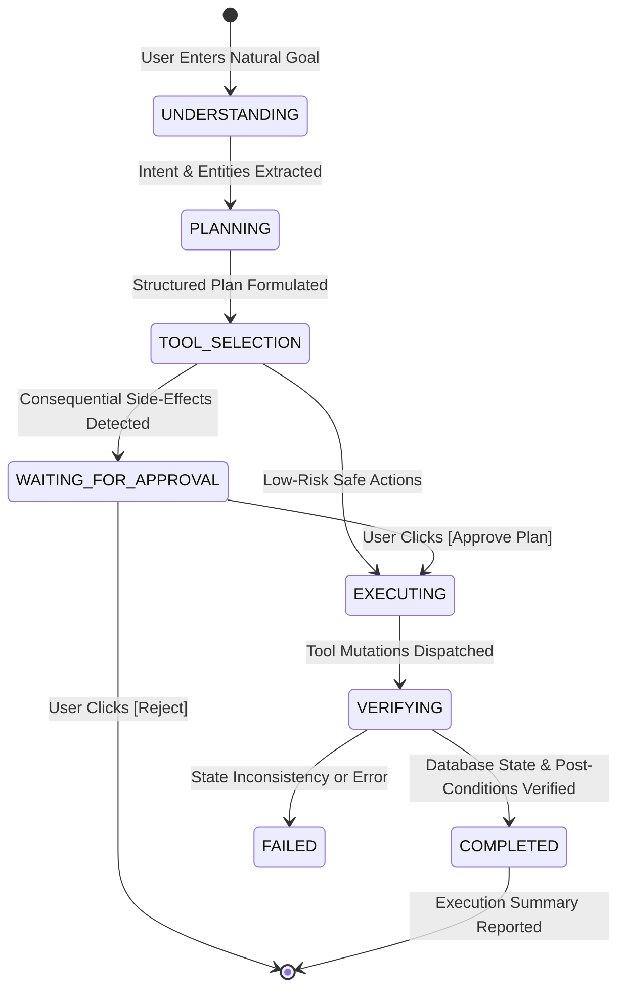

# ⚡ TaskPilot Agent

> **Autonomous AI Agent for Everyday Apps**  
> *Build Fast with AI Challenge 2026 — Problem Statement 01 (PS 01)*

[](tests/)
[](https://www.python.org/)
[](https://fastapi.tiangolo.com/)
[](aws/architecture.md)
[](LICENSE)

---

## 🎯 Problem Statement (PS 01)

Modern users toggle between calendar apps, to-do lists, reminder notifications, email clients, and project boards. While these individual applications exist, **users still bear 100% of the cognitive overhead** to manually decompose broad outcomes, prioritize subtasks, schedule time slots, set alarms, and follow through on deliverables.

### The Solution: TaskPilot Agent
**TaskPilot Agent** is an autonomous AI productivity layer that transforms high-level natural language goals into concrete multi-step executions. Users declare **outcomes** rather than micromanaging individual tasks:

$$\textbf{User Goal} \longrightarrow \textbf{AI Planning} \longrightarrow \textbf{Tool Selection} \longrightarrow \textbf{Human Confirmation Gate} \longrightarrow \textbf{Tool Execution} \longrightarrow \textbf{State Verification} \longrightarrow \textbf{Result}$$

---

## 🚀 Key Differentiator: Autonomous Behavior vs. Simple Chatbots

TaskPilot is **not** a generic conversational chatbot or basic CRUD task manager:
- 🧠 **Autonomous Decomposition:** Breaks vague goals (e.g., *"Finish my AWS project by Friday"*) into structured milestones with priorities, effort estimates, and dependencies.
- 🛠 **Tool Framework:** Autonomously invokes tasks, focus schedules, calendar optimizations, reminders, and notifications.
- 🛡 **Human-in-the-Loop Safety:** Distinguishes between low-risk operations (which execute automatically) and consequential operations (such as task deletion, email dispatch, or large plan activation) requiring human sign-off.
- 🔍 **Post-Condition State Verification:** Tests whether each executed tool actually mutated the database and satisfied expected conditions before reporting success.
- 💾 **Non-Sensitive Memory:** Stores and respects user work habits, focus windows (e.g., *evening focus 7 PM - 9 PM*), and cognitive preferences without storing secrets.

---

## 🏗 Autonomous Agent Architecture

The agent orchestration layer is strictly decoupled into modular services under `backend/agent/`:

```
backend/agent/
├── orchestrator.py        # Central state machine managing execution lifecycle
├── intent_analyzer.py     # Intent classification, entity parsing, and memory triggers
├── planner.py             # Structured plan formulation & milestone decomposition
├── tool_selector.py       # Tool pipeline assembly & human-safety confirmation check
├── executor.py            # Tool execution engine with resilient error handling & audit logging
├── verifier.py            # Post-condition database integrity validation
├── memory.py              # User habit & preference learning engine
├── prompts.py             # System prompts and planning templates
└── providers.py           # AI Provider abstraction (LocalProvider + BedrockProvider)
```

### Execution State Machine



---

## 🛠 Tool Framework

Every tool implements the `BaseTool` interface with schema validation, default confirmation flags, and structured `ToolResult` outputs:

1. **Task Tool (`task_tool`)** — Create, update, delete, complete, and list tasks with priority and deadlines. (Deletions trigger confirmation).
2. **Reminder Tool (`reminder_tool`)** — Schedule in-app alerts, deadline alarms, and dismiss reminders.
3. **Schedule Tool (`schedule_tool`)** — Generate focus blocks, reschedule, and autonomously optimize daily calendar based on user memory.
4. **Planning Tool (`planning_tool`)** — Deconstruct high-level goals into phased subtasks with dependency graphs.
5. **Search Knowledge Tool (`search_knowledge_tool`)** — Curated productivity, time-blocking, and AWS exam guidance.
6. **Notification Tool (`notification_tool`)** — Dispatch simulated in-app alerts and priority notifications.
7. **Simulated External Integrations (`simulated_tools`)** — Extensible architecture with explicit `[Demo / Simulated Tool]` tags:
   - `GmailTool` (Requires confirmation before simulated dispatch)
   - `SlackTool` (Requires confirmation before simulated broadcast)
   - `GoogleCalendarTool`
   - `NotionTool`
   - `OutlookTool`
   - `TodoistTool`

---

## 📊 Application Tour & UI Features

| Feature View | Description | Screenshot / Visual |
| :--- | :--- | :--- |
| **Dashboard** | Personalized greeting, metric counters, today's core focus, quick command bar with instant scenario chips, and real-time audit stream. | *Metric Cards & Quick Command Box* |
| **Agent Workspace** | **Hero 3-Column Layout:** (1) Goal Input & Preset Scenarios, (2) Live Execution Timeline with state progress nodes, (3) Visual Plan Breakdown + Approval Card. | *Interactive State Progression* |
| **Tasks Management** | Toggle between **Kanban Board** (`TODO`, `IN_PROGRESS`, `BLOCKED`, `COMPLETED`) and **List View** with search, priority, and category filters. Includes AI actions (*"Prioritize with AI"*, *"Break into subtasks"*, *"Explain importance"*). | *Kanban + AI Actions* |
| **Calendar & Schedule** | Daily focus schedule blocks, active reminders, and 1-click **"Optimize my schedule with AI"** button. | *Focus Schedule Stream* |
| **Activity & Audit Log** | Transparent audit trail listing timestamps, tool names, inputs, outputs, execution time, and verification badges. | *Audit Verification Grid* |
| **Agent Memory** | Stored user preferences (e.g. `preferred_working_hours`, `preferred_evening_focus`) with manual deletion and safety disclosures. | *User Preferences Cards* |

---

## 🎬 5 Core Demo Scenarios (100% Zero-Key Offline Ready)

TaskPilot includes 5 pre-calibrated demo scenarios runnable from the Agent Workspace or Quick Chips:

1. **Finish AWS Project by Friday (Hero Demo)**:
   - **Goal:** `"Create a plan to finish my AWS project by Friday."`
   - **Flow:** Goal understood $\rightarrow$ 6-phase milestone plan generated $\rightarrow$ Tools selected (`planning_tool`, `task_tool`, `schedule_tool`, `reminder_tool`, `notification_tool`) $\rightarrow$ Human approval requested $\rightarrow$ User approves $\rightarrow$ Tasks created $\rightarrow$ Schedule optimized $\rightarrow$ Reminder set $\rightarrow$ Actions verified $\rightarrow$ Completion summary shown.
2. **Prepare for AWS Exam**:
   - **Goal:** `"Create a 7-day study plan for my AWS Solutions Architect Associate exam."`
   - **Flow:** Generates Day 1 through Day 7 study modules and schedules them during evening focus hours based on user memory preferences.
3. **Plan My Day**:
   - **Goal:** `"Plan my day and prioritize my tasks."`
   - **Flow:** Triages urgent items, creates morning deep focus sprints, and organizes the calendar.
4. **Create Hackathon Plan**:
   - **Goal:** `"Create a complete hackathon execution plan."`
   - **Flow:** Decomposes deliverable into app finalization, automated testing, demo video recording, pitch deck, and submission verification.
5. **Human Safety Interception**:
   - **Goal:** `"Delete task 1 permanently."`
   - **Flow:** Agent detects high-risk deletion, halts execution, and renders the confirmation modal before mutating data.

---

## 📦 Technology Stack

- **Backend:** Python 3.11+, FastAPI 2.0, Uvicorn, Pydantic v2
- **Database:** SQLite with WAL mode, foreign keys, and clean repository abstraction pattern (1:1 mapped to Amazon DynamoDB)
- **Security:** JWT authentication, bcrypt password hashing, CORS protection, parameter sanitization
- **AI Engine:**
  - `LocalProvider`: Deterministic heuristic reasoning engine (100% offline, zero latency, zero API costs)
  - `BedrockProvider`: Amazon Bedrock integration (`boto3`, Claude 3.5 Sonnet / Amazon Titan) with automatic fallback
- **Frontend:** Vanilla JavaScript (ES6+), Modern CSS3 with Glassmorphism, Plus Jakarta Sans typography, responsive flex/grid layouts
- **Testing:** Pytest (30 comprehensive tests covering auth, CRUD, agent orchestrator, tools, approval safety, and health)

---

## 🚦 System Architecture & Cloud Readiness Matrix

To maintain honesty and production transparency:

| Layer | IMPLEMENTED LOCALLY | AWS-READY (ARCHITECTED) | FUTURE SCOPE |
| :--- | :--- | :--- | :--- |
| **Compute** | FastAPI + Uvicorn server | AWS Lambda with Mangum ASGI adapter + Amazon API Gateway | Multi-region active-active deployment |
| **AI Inference**| LocalProvider heuristic engine | Amazon Bedrock Claude 3.5 Sonnet / Titan Text via `boto3` | Amazon Bedrock Agents + OpenSearch Serverless Knowledge Base |
| **Storage** | SQLite with repository pattern | Amazon DynamoDB Single-Table NoSQL schema (`aws/architecture.md`) | DynamoDB Global Tables with automated backup |
| **Identity** | JWT + bcrypt password auth | Amazon Cognito User Pools with JWT verification | Enterprise SSO (SAML 2.0 / Okta / Azure AD) |
| **Hosting** | Local static file server | AWS Amplify Hosting or S3 + CloudFront CDN | Native mobile PWA with WebPush |
| **Tool APIs** | Native Task, Schedule, Reminders + Simulated External Tools | Lambda event-driven tools + EventBridge | Live OAuth2 integrations with Google Calendar, Gmail, Slack, and Notion |

---

## 💻 Quick Start / Local Setup

### 1. Clone & Navigate
```bash
git clone https://github.com/PRAVIN-KUMAR-295/taskpilot-agent.git
cd taskpilot-agent
```

### 2. Environment Configuration
Create or inspect the `.env` file in the root directory:
```bash
# Server
HOST=127.0.0.1
PORT=8000

# Security
JWT_SECRET=taskpilot-agent-super-secret-jwt-key-2026
JWT_EXPIRATION_MINUTES=1440

# AI Provider ("auto", "bedrock", or "local")
AI_PROVIDER=auto

# Optional: AWS Bedrock Settings (Leave blank to run 100% offline with LocalProvider)
AWS_REGION=us-east-1
BEDROCK_MODEL_ID=anthropic.claude-3-5-sonnet-20241022-v2:0
AWS_ACCESS_KEY_ID=
AWS_SECRET_ACCESS_KEY=
```

### 3. Install Dependencies
```bash
python -m venv backend/.venv
# On Windows:
backend\.venv\Scripts\pip install -r backend/requirements.txt
# On Linux/macOS:
source backend/.venv/bin/activate && pip install -r backend/requirements.txt
```

### 4. Run the Application
```bash
# On Windows:
backend\.venv\Scripts\python -m uvicorn backend.main:app --host 127.0.0.1 --port 8000 --reload
# On Linux/macOS:
python -m uvicorn backend.main:app --host 127.0.0.1 --port 8000 --reload
```

### 5. Access the Interface
Open your browser to:
👉 **`http://127.0.0.1:8000/`** or **`http://localhost:8000/`**

- Default Demo User: `demo@taskpilot.ai` / password: `password123` (auto-seeded).

---

## 🧪 Testing & Verification

TaskPilot includes a comprehensive suite of **30 automated tests**:

```bash
# Run the complete test suite:
backend\.venv\Scripts\python -m pytest tests/ -v
```

### Test Coverage Highlights:
- `tests/test_auth.py` — Password hashing, JWT token issuance, user registration, and login.
- `tests/test_tasks.py` — Task CRUD, status updates, priority filtering, and AI task actions.
- `tests/test_agent_orchestrator.py` — Complete agent state machine (`UNDERSTANDING` $\rightarrow$ `PLANNING` $\rightarrow$ `WAITING_FOR_APPROVAL` $\rightarrow$ `EXECUTING` $\rightarrow$ `VERIFYING` $\rightarrow$ `COMPLETED`).
- `tests/test_tools.py` — Individual validation and execution tests for tools and safety checks.
- `tests/test_memory_and_schedule.py` — Preference persistence, schedule optimization, and audit logging.
- `tests/test_agent.py` — Backward compatibility and error handling tests.

---

## ☁️ AWS Deployment Documentation

Detailed cloud infrastructure blueprints and deployment guides are available in the `/aws` folder:
- 📖 [**AWS Architecture Guide (`aws/architecture.md`)**](aws/architecture.md) — Single-Table DynamoDB schema design, Bedrock runtime invocation architecture, and security policies.
- 🚀 [**AWS Deployment Guide (`aws/deployment.md`)**](aws/deployment.md) — Serverless Application Model (SAM) templates, Amplify deployment steps, and Bedrock IAM permissions.

---

## 🛡 Security & Human-in-the-Loop Safeguards

1. **No Credentials in Frontend:** No secret keys or cloud tokens are ever served to or stored on client devices.
2. **Approval Gates for Consequential Mutations:** Deletions, table purges, and communication dispatches pause execution until approved.
3. **Password Security:** Salted bcrypt password hashing with constant-time verification.
4. **Clean Error Handling:** Catches all exceptions gracefully and provides user-friendly recovery messages without leaking stack traces.
5. **Privacy Memory Scrubbing:** Non-sensitive preferences only; sensitive credentials and tokens are scrubbed.

---

## 📄 License

This project is licensed under the MIT License — see the [LICENSE](LICENSE) file for details.