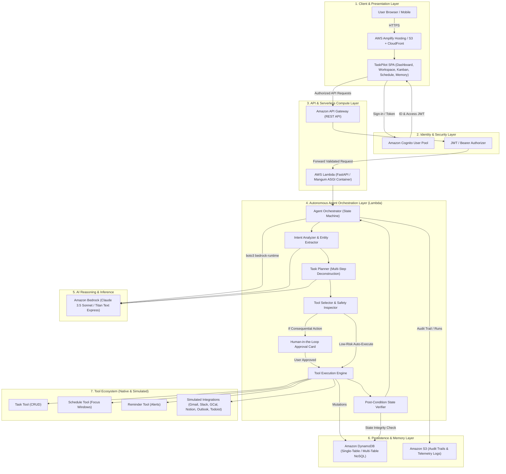

# TaskPilot Agent — AWS Cloud Architecture

**Problem Statement:** PS 01 – Autonomous Agents for Everyday Apps  
**Project:** TASKPILOT AGENT  
**Status Matrix:** Implemented Locally (Active) | AWS-Ready (Architected) | Future Integration (Roadmap)

---

## 1. System Architecture Overview

TaskPilot Agent acts as an autonomous intelligence and execution layer between everyday users and productivity tools. Instead of users manually coordinating tasks across calendars, task managers, and reminders, TaskPilot orchestrates:

$$\text{User Goal} \longrightarrow \text{Intent Analysis} \longrightarrow \text{Task Planner} \longrightarrow \text{Tool Selection} \longrightarrow \text{Human Confirmation Gate} \longrightarrow \text{Tool Execution} \longrightarrow \text{Post-Condition Verification} \longrightarrow \text{State Persistence}$$



---

## 2. Implementation Status: Local vs. AWS-Ready vs. Future

| Component | Implemented Locally (Active) | AWS-Ready (Architected) | Future Integration (Roadmap) |
| :--- | :--- | :--- | :--- |
| **Frontend** | Vanilla JS SPA with responsive CSS, Glassmorphism dark mode, 3-column Workspace, Kanban, Calendar, Audit Log, and Memory | AWS Amplify Hosting or S3 static website hosting fronted by Amazon CloudFront CDN with TLS 1.3 | Progressive Web App (PWA) with native mobile push notifications |
| **Backend API** | FastAPI running on Uvicorn ASGI server with REST endpoints | AWS Lambda using Mangum adapter behind Amazon API Gateway HTTP/REST API | Multi-region active-active Lambda with Amazon Route 53 latency routing |
| **AI Provider** | LocalProvider (deterministic, zero-key heuristics) + BedrockProvider fallback | Amazon Bedrock Claude 3.5 Sonnet (`anthropic.claude-3-5-sonnet-20241022-v2:0`) and Titan Text Express via boto3 | Amazon Bedrock Agents with Knowledge Bases (Amazon OpenSearch Serverless) |
| **Database** | SQLite with WAL mode, foreign keys, thread-safe connection pooling and repository pattern | Amazon DynamoDB partitioned tables with Global Secondary Indexes (GSI) | Amazon DynamoDB Global Tables with point-in-time recovery (PITR) |
| **Authentication** | JWT tokens with bcrypt password hashing and Bearer security scheme | Amazon Cognito User Pools with hosted UI, JWT authorizer on API Gateway | Enterprise SSO with SAML 2.0 / OIDC (Okta, Google Workspace, Azure AD) |
| **Tool Ecosystem** | TaskTool, ReminderTool, ScheduleTool, PlanningTool, SearchKnowledgeTool, NotificationTool, and Simulated Integrations | AWS Lambda invocation of event-driven tools; Amazon EventBridge for scheduled reminders | Real OAuth2 integrations with Google Calendar, Gmail, Slack, and Notion APIs |

---

## 3. Amazon DynamoDB Schema Mapping

The local SQLite repositories (`UserRepository`, `TaskRepository`, `ReminderRepository`, `ScheduleRepository`, `PlanRepository`, `AgentRunRepository`, `AgentActionRepository`, `MemoryRepository`) map directly to an Amazon DynamoDB schema design:

### Table: `TaskPilotStore` (Single-Table Design)

| Entity | Partition Key (`PK`) | Sort Key (`SK`) | Attributes / Payload | GSI1-PK / GSI1-SK |
| :--- | :--- | :--- | :--- | :--- |
| **User** | `USER#<user_id>` | `PROFILE` | `email`, `name`, `password_hash`, `created_at` | `EMAIL#<email>` / `USER#<user_id>` |
| **Task** | `USER#<user_id>` | `TASK#<task_id>` | `title`, `description`, `priority`, `status`, `due_date`, `duration`, `category` | `STATUS#<status>` / `PRIORITY#<priority>` |
| **Reminder**| `USER#<user_id>` | `REMINDER#<reminder_id>` | `task_id`, `title`, `reminder_time`, `status`, `channel` | `REMINDER_STATUS#<status>` / `<reminder_time>` |
| **Schedule**| `USER#<user_id>` | `SCHEDULE#<schedule_id>` | `title`, `start_time`, `end_time`, `day_of_week`, `session_type`, `is_optimized` | `DAY#<day_of_week>` / `<start_time>` |
| **Plan** | `USER#<user_id>` | `PLAN#<plan_id>` | `goal`, `status`, `total_tasks`, `estimated_days`, `plan_data` | `PLAN_STATUS#<status>` / `CREATED#<timestamp>` |
| **Agent Run**| `USER#<user_id>` | `RUN#<run_id>` | `goal`, `intent`, `status`, `requires_approval`, `action_payload`, `summary` | `RUN_STATUS#<status>` / `<created_at>` |
| **Agent Action**| `USER#<user_id>` | `ACTION#<timestamp>#<id>`| `run_id`, `tool_name`, `action_name`, `input_data`, `output_data`, `status`, `verification_status` | `TOOL#<tool_name>` / `STATUS#<status>` |
| **Memory** | `USER#<user_id>` | `MEMORY#<key>` | `key`, `value`, `category`, `source`, `confidence`, `updated_at` | `CATEGORY#<category>` / `KEY#<key>` |

---

## 4. Amazon Bedrock AI Provider Integration

```python
# Server-side invocation pattern implemented in backend/agent/providers.py
import json
import boto3

bedrock = boto3.client("bedrock-runtime", region_name=AWS_REGION)

def invoke_bedrock_agent_planner(goal: str, memory_context: dict) -> dict:
    prompt = f"Goal: {goal}. User Preferences: {json.dumps(memory_context)}. Formulate structured subtasks."
    body = json.dumps({
        "anthropic_version": "bedrock-2023-05-31",
        "max_tokens": 1000,
        "messages": [{"role": "user", "content": prompt}]
    })
    response = bedrock.invoke_model(
        modelId="anthropic.claude-3-5-sonnet-20241022-v2:0",
        body=body
    )
    result = json.loads(response["body"].read())
    return json.loads(result["content"][0]["text"])
```

### Prompt Engineering & Fallback Policy:
1. **Zero-Key Guarantees:** When AWS credentials are not configured, TaskPilot transparently activates `LocalProvider`, utilizing heuristic intent classification and domain rules.
2. **Never Expose Credentials:** No AWS secret keys, access keys, or region variables are ever sent to client browsers.

---

## 5. Security & Human-in-the-Loop Safety Architecture

1. **Destructive Action Interceptors:**
   - Permanent task deletions, clearing tables, and external messaging actions are strictly flagged with `requires_confirmation = True`.
   - The orchestrator pauses in `WAITING_FOR_APPROVAL` state and returns an `action_pending_approval` payload.
   - Database mutations are halted until the user signs off via `[Approve Execution]`.
2. **Audit & Verification:**
   - Every tool execution logs inputs, outputs, timestamps, and post-condition verification checks into the `agent_actions` audit log.
